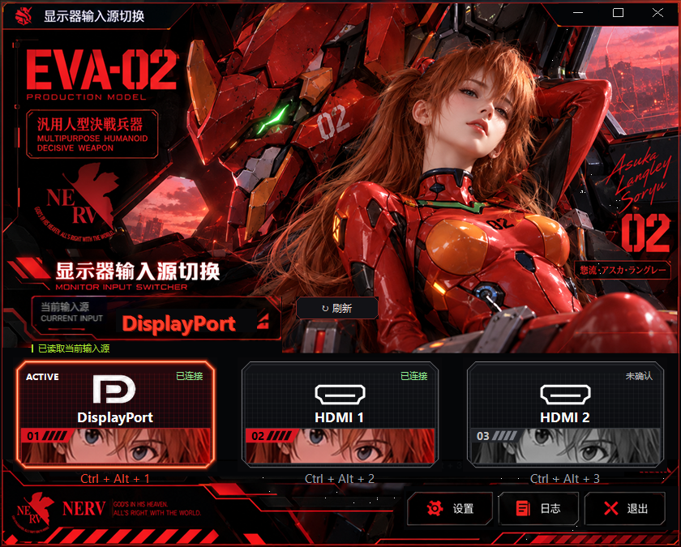

# Monitor Input Switcher / 显示器输入源切换

**一台显示器，两台电脑，一键切换。**
**One monitor. Two computers. One-click input switching.**

为共用一台显示器的台式机与笔记本准备的 Windows 小工具。点击输入卡片，或按 `Ctrl + Alt + 1 / 2 / 3`，通过 DDC/CI 切换显示器输入源，减少伸手操作背后摇杆、逐级进入输入菜单的步骤。

A Windows utility for a desktop and laptop sharing one monitor. Click an input card or press `Ctrl + Alt + 1 / 2 / 3` to switch the monitor input over DDC/CI, without navigating the monitor's rear joystick menu each time.

*软件自检生成的界面预览，展示 DP / HDMI 卡片和连接状态；不是原始概念图，也不代表进行了物理切换。非官方 EVA 同人主题。*
*Application-rendered preview showing the DP / HDMI cards and connection states. This is not a concept image or evidence of a physical switch. Unofficial EVA fan theme.*

## 适合谁 / Who is it for?

- 一台显示器连接两台电脑，例如台式机走 DP、工作笔记本走 HDMI。
- 经常在工作、学习和游戏电脑之间切换，不想反复操作显示器的实体菜单。
- 使用支持 DDC/CI 的 Windows 显示器；目前输入映射以 ASUS ROG Strix XG27AQ 为验证对象，其他型号需核对映射。

Ideal for people sharing one monitor between a desktop and a laptop, frequently switching between work and gaming, and using a monitor with DDC/CI enabled. The verified input mapping targets the ASUS ROG Strix XG27AQ; other models require checking their mappings.

### 为什么做这个 / Why this project?

我的使用场景是台式机和笔记本共用一台 ROG 显示器。原来切换输入源需要摸到显示器背后的摇杆，再进入菜单操作数次。这个项目把常用切换放到输入卡片和全局快捷键上，让操作更直接。

My desktop and laptop share a ROG monitor. Switching inputs meant reaching for the rear joystick and stepping through the on-screen menu. This project moves that everyday action to a desktop button and global shortcut.

切换输入不等于远程控制另一台电脑。每台需要使用快捷键的 Windows 电脑都应运行软件；切换后另一台电脑的控制由它自己的软件实例提供。它不提供键盘鼠标共享，也不是硬件 KVM。

Input switching does not remotely control the other computer. Run the utility on each Windows computer that needs shortcuts. After switching, control comes from the instance on that computer. It does not share a keyboard/mouse or provide a hardware KVM.

Windows 10/11; Windows PowerShell 5.1 and .NET Framework; no additional runtime installation.

## 使用 / Usage

先运行 `Build.ps1` 构建，再双击 `MonitorSwitch-Neon.exe`。在设置中选择“中文 / English”并保存，立即切换语言，重启后保持。
Build with `Build.ps1`, then run `MonitorSwitch-Neon.exe`. Choose Chinese or English in Settings and Save. Language changes immediately and persists.

- DP、HDMI 1、HDMI 2 三张输入卡片；Ctrl+Alt+1/2/3 快捷键。
- Three input cards: DP, HDMI 1 and HDMI 2; global shortcuts Ctrl+Alt+1/2/3.
- 关闭窗口收起到托盘；再次启动唤起已有窗口，始终只有一个托盘图标。
- Closing hides to the tray. Launching again restores the existing instance.
- 当前输入边框高亮；人物彩色表示 Windows 检测或用户确认已连接。
- The border marks the active input. Color portraits indicate locally detected or user-confirmed connections.
- 本机通常无法查询另一台电脑连接的输入。手动确认不会随拔线自动改变。
- Remote computer connections cannot generally be queried locally. Manual confirmation does not automatically change when a cable is unplugged.

## 输入映射 / Input mapping

ASUS XG27AQ verified VCP 0x60 values: DisplayPort=15 (0x0F), HDMI 1=17 (0x11), HDMI 2=18 (0x12).
Other monitors may use different mappings. Enable DDC/CI in your monitor OSD. Settings preserve the configured DP/HDMI 1 values.

## 构建 / Build

Run `Build.ps1` using Windows PowerShell 5.1. The launcher depends on the scripts, C# files, icon and assets in this directory; the EXE alone is insufficient.

## 验证 / Verification

Run `Test-Logic.ps1`, `Test-Connection.ps1`, `Test-CardLayout.ps1`, and `Test-Language.ps1` in Windows PowerShell 5.1.
`Test-SingleInstance.ps1` launches and exits a real application instance. Avoid running it while using the application.
Visual self-test: `MonitorSwitch.ps1 -SelfTest -PreviewPort 15 -ShotPath <absolute PNG path>`.
Tests simulate input states; successful tests do not prove a physical input change on every monitor.

## 开源准备 / Publishing preparation

Code is available under PolyForm Noncommercial 1.0.0: noncommercial use, modification and sharing are permitted subject to LICENSE and NOTICE. Commercial use and sale are not granted. This is source-available software, rather than OSI-approved open source. Theme contributions are separately licensed under CC BY-NC-SA 4.0 only to the extent the contributor can grant those rights. Third-party EVA rights are excluded; see ASSETS.md.
Personal `config.json`, runtime logs, generated EXEs and test screenshots are ignored. Share a sanitized `config.example.json` instead.

Windows APIs: QueryDisplayConfig, GetVCPFeatureAndVCPFeatureReply, SetVCPFeature.

The sample config contains only a language preference. Copy it to config.json if desired; configure monitor input mappings and connections locally in Settings.
